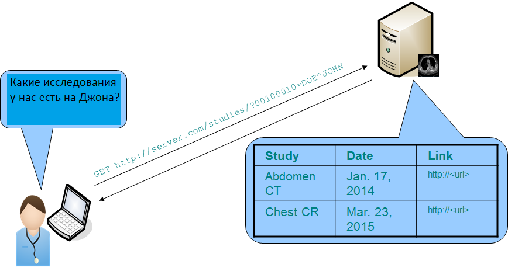

### Введение

Пока постановка задачи расплывчата и выдавать по метаданным файлы снимков - это одно, хранить для анализа - это другое. хранить так, чтоб нейросетка могла делать анализ и куда-то дописывать данные - это наверное третье, кроме того есть еще отдельная задача разметки снимков для автодиагностики и их тоже надо хранить по другому. Вообще общеизвестно, что в при разработке архитектуры СУБД первое что нужно понять - какие именно запросы пользователей планируется исполнять с её помощью. Важны их синтаксис и семантика. Например, учёт простого требования поддержки wild-card может сильно изменить предполагаемую без этого требования архитектуру.

Пока мы плаваем в постановке, отвожу какое-то время на исследование задачи вообще. Логика моих действий пока следующая. Я иду с двух сторон: сверху - по стандарту и пытаюсь выцепить и понять куски, относящиеся к задаче хранения и анализа и снизу - ищу примеры DICOM-вьюеров и куски веб-сервисов с открытым исходным кодом, из которых пытаюсь понять "как люди делают". 

Исходя из постановки задачи, пока решил обращать внимание на: 

1) хранение, обработку и извлечение данных преимущественно по стандарту DICOM для медицинской визуализации именно в веб и облачных хранилищах;

2) что пишут про искусственный интеллект (ИИ) и DICOM (в части работы с данными);

3) разметку изображений для автоматизированного анализа и помощи в постановке диагноза (в части работы с данными).

Думаю, что это будет некий документ со ссылками, который можно будет прочесть, вникнуть в задачу и поставить более конкретно, скорее всего в процессе детализации автоматом родится и схема хранения. 

### Перевод терминов(правильно-ли?)

> studies - исследования
>
> series - серии в исследовании
>
> instances - экземпляры в серии
>
> rendered study/series... - визуализированное представление исследования, серии...

### DICOMweb

DICOMweb™ - это стандарт DICOM для веб-медицинской визуализации. Стандарт представляет собой набор RESTful сервисов, позволяющий веб-разработчикам работать с DICOM-изображениями с помощью согласованных со стандартом наборов инструментов.

#### Search (QIDO-RS)

Стандарт на поиск DICOM объектов [DICOM PS3.18 10.6](http://dicom.nema.org/medical/dicom/current/output/chtml/part18/sect_10.6.html)



Запрос на основе идентификатора для объектов DICOM (QIDO) позволяет искать исследования, серии и экземпляры по идентификатору пациента (patient ID) и получать их уникальные идентификаторы для дальнейшего использования (т. е. для получения их визуализированных представлений).

Пример синтаксиса:

```
GET SP "/" {/resource} {?search*} SP version CRLF
Accept: 1#search-media-type CRLF
*(header-field CRLF)
CRLF
```

 Где

```
search-media-type =multipart/related; type="application/dicom+xml"/ dicom-json
```

Типы search-запросов:

| Verb | Path                                            | Description                     |
| ---- | ----------------------------------------------- | ------------------------------- |
| GET  | {s}/studies?…                                   | Запрос для исследований         |
| GET  | {s}/studies/{study}/series?…                    | Запрос для серий в исследовании |
| GET  | {s}/studies/{study}/series/{series}/instances?… | Запрос для экземпляров в сериях |

Возможные вариации запроса в зависимости от               

| Resource                  | URI Template                                         | Native | Proxy | Query Type   |
| ------------------------- | ---------------------------------------------------- | ------ | ----- | ------------ |
| All Studies               | /studies{?search*}                                   | M      | M     | hierarchical |
| Study's Series            | /studies/{study}/series{?search*}                    | M      | M     | hierarchical |
| Study's Instances         | /studies/{study}/instances{?search*}                 | M      | O     | relational   |
| All Series                | /series{?parameter*}                                 | M      | O     | relational   |
| Study's Series' Instances | /studies/{study}/series/{series}/instances{?search*} | M      | M     | hierarchical |
| All Instances             | /instances{?search*}                                 | M      | O     | лrelational  |

где M (Mandatory) - обязательный, O (Optional) - необязательный

подробнее здесь: http://dicom.nema.org/medical/dicom/current/output/chtml/part18/sect_10.6.html

запрос может быть иерархический, когда идём начиная с верхнего уровня в информационной модели запроса/извлечения и продолжая до тех пор, пока не будет достигнут уровень, указанный в запросе C-FIND, ниже по ссылке описывается как надо делать этот иерархический спуск

либо

запрос может быть реляционный, когда можно использовать любую комбинацию ключей на любом уровне иерархии. Уникальный ключевой атрибут, связанный с уровнем запроса / извлечения, должен содержаться в запросе C-FIND и может указывать совпадение одного значения, универсальное совпадение значений или список совпадений UID. Это, видимо, что-то вроде сквозного фильтра, который матчит по полям, игнорируя иерархию.

Что такое C-FIND?

Как я понял, в стандарте есть понятие прикладного уровня обращения к БД снимков. И семантически описание извлечение данных происходит не в терминах SQL, например, а в виде базовых информационных запросов к экземплярам составных объектов с использованием небольшого набора общих ключевых атрибутов. Таких семантических операций по-сути три:   C-FIND,    C-MOVE,    C-GET. Первая находит ищет по параметрам и по сути возвращает системные идентификаторы, соответствующие данным. Причем их природа (этих кусков данных) может быть различна.  Трудно привести пока пример, но видимо это что-то из серии найти снимки и недавнего МРТ головы этого пациента и плюс УЗИ шеи двухлетней давности. Дальше эти идентификаторы передаются на шаг MOVE, который бегает по различным сервисам(?) и эти куски собирает и потом, если куски собраны успешно, то можно, оценив результат C-MOVE , уже запросить итоговую выборку с помощью C-GET.

подробности здесь http://dicom.nema.org/medical/dicom/current/output/chtml/part04/chapter_C.html.

```
/studies?PatientID=11235813
/studies?PatientID=11235813&StudyDate=20130509
/studies?00100010=SMITH*&00101002.00100020=11235813&limit=25
/studies?00100010=SMITH*&OtherPatientIDsSequence.00100020=11235813
/studies?PatientID=11235813&includefield=00081048,00081049,00081060
/studies?PatientID=11235813&includefield=00081048&includefield=00081049&includefield=00081060
/studies?PatientID=11235813&StudyDate=20130509-20130510
/studies?StudyInstanceUID=1.2.392.200036.9116.2.2.2.2162893313.1029997326.94587,1.2.392.200036.9116.2.2.2.2162893313.1029997326.94583
/studies?00230010=AcmeCompany&includefield=00231002&includefield=00231003
/studies?00230010=AcmeCompany&00231001=001239&includefield=00231002&includefield=00231003
```


Например, вот кусок метаданных из одного из наших демофайлов:
###### DataDemo

`(0008, 0005) Specific Character Set              CS: 'ISO_IR 100'`
`(0008, 0008) Image Type                          CS: ['DERIVED', 'PRIMARY', 'AXIAL', 'CT_SOM5 MPR']`
`(0008, 0016) SOP Class UID                       UI: CT Image Storage`
`(0008, 0018) SOP Instance UID                    UI: 1.3.12.2.1107.5.1.4.59574.30000020010906365700600020656`
`(0008, 0020) Study Date                          DA: '20200109'`
`(0008, 0021) Series Date                         DA: '20200109'`
`(0008, 0022) Acquisition Date                    DA: '20200109'`
`(0008, 0023) Content Date                        DA: '20200109'`
`(0008, 0030) Study Time                          TM: '111357.988000'`
`(0008, 0031) Series Time                         TM: '130051.335000'`
`(0008, 0032) Acquisition Time                    TM: '111709.524986'`
`(0008, 0033) Content Time                        TM: '111709.524986'`
`(0008, 0050) Accession Number                    SH: ''`
`(0008, 0060) Modality                            CS: 'CT'`
`(0008, 0070) Manufacturer                        LO: 'SIEMENS'`
`(0008, 0080) Institution Name                    LO: 'Clinika'`
`(0008, 0081) Institution Address                 ST: 'Volgogradskiy\r\nMoscow/3791ae/\r\nDistrict\r\nRU'`
`(0008, 0090) Referring Physician's Name          PN: ''`
`(0008, 1010) Station Name                        SH: 'CTAWP00000'`
`(0008, 1030) Study Description                   LO: 'Abdomen^Thor_AbdMultiPhase (Adult)'`
`(0008, 103e) Series Description                  LO: 'ThorRoutine  1.5  MPR  cor'`
`(0008, 1050) Performing Physician's Name         PN: 'Ivanova E.N.'`
`(0008, 1070) Operators' Name                     PN: 'PETROVA A.YU.'`
`(0008, 1090) Manufacturer's Model Name           LO: 'SOMATOM Perspective'`
`(0008, 1140)  Referenced Image Sequence   1 item(s) ----`
   `(0008, 1150) Referenced SOP Class UID            UI: CT Image Storage`

   `(0008, 1155) Referenced SOP Instance UID         UI: 1.3.12.2.1107.5.1.4.59574.30000020010906365700600020602`

`(0008, 2112)  Source Image Sequence   1 item(s) ----`
   `(0008, 1150) Referenced SOP Class UID            UI: 1.3.12.2.1107.5.9.1`
   `(0008, 1155) Referenced SOP Instance UID         UI: 1.3.12.2.1107.5.1.4.59574.30000020010904503663600002891`

​    Значения в скобочках - это теги из словаря - классификатора, в частности по ним и происходит поиск.   Они собраны в словаре в некоторую понятную иерархию: http://dicom.nema.org/medical/dicom/current/output/chtml/part18/sect_10.6.html#table_10.6.1-5

| IE Level | Attribute Name      | Tag         |
| -------- | ------------------- | ----------- |
| Study    | Study Date          | (0008,0020) |
|          | Study Time          | (0008,0030) |
|          | Accession Number    | (0008,0050) |
|          | ...                 |             |
| Series   | Modality            | (0008,0060) |
|          | Series Instance UID | (0020,000E) |
|          | ...                 |             |
|          | Study Instance UID  | (0020,000D) |
| Instance | Instance Number     | (0020,0013) |

#### Retrieve

Стандарт на извлечение DICOM объектов [DICOM PS3.18 10.4](http://dicom.nema.org/medical/dicom/current/output/chtml/part18/sect_10.4.html)

Стандарт на извлечение отдельных DICOM экземпляров [DICOM PS3.18 10.4](http://dicom.nema.org/medical/dicom/current/output/chtml/part18/sect_10.4.html)


Позволяет получать конкретные исследования, серии и экземпляры по ссылкам. Этот запрос может возвращать экземпляры DICOM как в бинарном виде, так и в виде, более удобном для отображения.

###### Пример синтаксиса Retrive-запроса
```
GET SP "/" {/resource} {?parameter*} SP versionCRLF
Accept: 1#media-type CRLF
*(header-fieldCRLF)
CRLF
```

Где parameter - один из параметров, перечисленных ниже в таблице

| Key        | Resource Category | Usage      | Section       |                                                              |
| ---------- | ----------------- | ---------- | ------------- | ------------------------------------------------------------ |
|            |                   | User Agent | Origin Server |                                                              |
| accept     | All               | O          | M             | [Section 8.3.3.1](http://dicom.nema.org/medical/dicom/current/output/chtml/part18/sect_8.3.3.html#sect_8.3.3.1) |
| charset    | Text              | O          | M             | [Section 8.3.3.2](http://dicom.nema.org/medical/dicom/current/output/chtml/part18/sect_8.3.3.2.html) |
| annotation | Rendered          | O          | M             | [Section 8.3.5.1.1](http://dicom.nema.org/medical/dicom/current/output/chtml/part18/sect_8.3.5.html#sect_8.3.5.1.1) |
| quality    | Rendered          | O          | M             | [Section 8.3.5.1.2](http://dicom.nema.org/medical/dicom/current/output/chtml/part18/sect_8.3.5.html#sect_8.3.5.1.2) |
| viewport   | Rendered          | O          | M             | [Section 8.3.5.1.3](http://dicom.nema.org/medical/dicom/current/output/chtml/part18/sect_8.3.5.html#sect_8.3.5.1.3) |
|            | Thumbnail         | O          | O             |                                                              |
| window     | Rendered          | O          | M             | [Section 8.3.5.1.4](http://dicom.nema.org/medical/dicom/current/output/chtml/part18/sect_8.3.5.html#sect_8.3.5.1.4) |
| iccprofile | Rendered          | O          | O             | [Section 8.3.5.1.5](http://dicom.nema.org/medical/dicom/current/output/chtml/part18/sect_8.3.5.html#sect_8.3.5.1.5) |

например параметр **accept** имеет следующий синтаксис:

```
accept      = accept-name "=" 1#(media-type [weight])
accept-name = %s"accept"
```

Типы retrive-запросов:


| Verb | Path                                                         | Description                                            |
| ---- | ------------------------------------------------------------ | ------------------------------------------------------ |
| GET  | {s}/studies/{study}                                          | Получить все исследование целиком                      |
| GET  | {s}/studies/{study}/rendered                                 | Получить визуализированное  представление исследования |
| GET  | {s}/studies/{study}/series/{series}                          | Извлечение всей серии целиком                          |
| GET  | {s}/studies/{study}/series/{series}/rendered                 | Получить визуализированное  представление серии        |
| GET  | {s}/studies/{study}/series/{series}/metadata                 | Получить метаданные серии                              |
| GET  | {s}/studies/{study}/series/{series}/instances/{instance}     | Получить экземпляр                                     |
| GET  | {s}/studies/{study}/series/{series}/instances/{instance}/rendered | Получить визуализированное  представление экземпляра   |
| GET  | {s}/studies/{study}/series/{series}/instances/{instance}/metadata | Получить метаданные экземпляра                         |
| GET  | {s}/studies/{study}/series/{series}/instances/{instance}/frames/{frames} | Получить фреймы экземпляра                             |
| GET  | {s}/{bulkdataURIReference}                                   | Массовое/пакетное извлечение данных                    |

Для понимания сложности синтаксиса и семантики работы с DICOM данными, немного пробегусь по синтаксису вглубь.

Синтаксис этих параметров определён в соответствии с тем., как они определяются в стандарте для URI (см [RFC3986](http://dicom.nema.org/medical/dicom/current/output/chtml/part18/chapter_2.html#biblio_RFC_3986) [Section 3.4](http://tools.ietf.org/html/rfc3986#section-3.4)), 

Параметры запроса имеют следующий синтаксис:

```
query-parameters = "?" parameter [*("&" parameter) ]
```

Каждый параметр после первого отделяется от следующего символом"&". Каждый параметр имеет следующий синтаксис:

```
parameter = qp-name 
          / qp-name "=" 1#qp-value
          / qp-name "=" 1#attribute
          / attribute 
          / attribute "=" 1#qp-value
```

Возьмем первый элемент  qp-name. Элемент чувствителен к регистру и начинается с буквенного или подчеркивающего символа, за которым следует ноль или более буквенно-цифровых или подчеркивающих символов"_":

```
qp-name = %s 1*(ALPHA / "_") *(ALPHA / DIGIT / "_")
```

qp-name может сопровождаться разделенным запятыми списком из одного или более qp-values, или из одного или нескольких attribute. К каждому из этих элементов тоже предъявляются свои требования по синтаксису и семантике.

qp-value чувствительно к регистру, оно состоит из qp-символов, где qp-char-это набор разрешенных символов из  [RFC3986](http://dicom.nema.org/medical/dicom/current/output/chtml/part18/chapter_2.html#biblio_RFC_3986), за вычетом символов равенства ( " = "), амперсанда ( " & " ) и запятой (","), например:

```
qp-value   = %s DQ 1*qp-char DQ
```

где qp-char - это одно из значений unreserved / pct-encoded / qp-special, а, например, 

```
qp-special = "!" / "$" / "'" / "(" / ")" / "*" / "+" / ";" /":" / "@" / "/" / "?"
```

Каждый attribute является либо простым атрибутом, либо атрибутом-последовательностью:

```
attribute = simple-attribute / sequence-attribute
```

A simple-attribute is a single Data Element Tag or Keyword 

simple-attribute это простые элементы keyword или tag, которые не помечены как последовательность значением SQ: например,в [примере данных](#datademo) 

`(0008, 1050) Performing Physician's Name         PN: 'Ivanova E.N.'`

tag = "(0008, 1050)", keyword = "Performing Physician's Name", пометка "PN"

все возможные элементы перечислены в классификаторе [Реестр DICOM Data Elements”](http://dicom.nema.org/medical/dicom/current/output/chtml/part06/chapter_6.html#table_6-1)) 

Синтаксис  simple-attribute:

```
simple-attribute = keyword / tag
keyword          = %s DQ 1*ALPHA *(ALPHA / DIGIT) DQ
tag              = 8HEXDIG
```

sequence-attribute - это два или более атрибута, разделенных символом точки ("."), все, кроме последнего атрибута, должны иметь метку SQ, а последний атрибут не должен иметь метку SQ.

Примеры валидных параметров:

```
0020000D
StudyInstanceUID
00101002.00100020
OtherPatientIDsSequence.PatientID
00101002.00100024.00400032
OtherPatientIDsSequence.IssuerOfPatientIDQualifiersSequence.UniversalEntityID
```

Итак, выше был разобрана часть синтаксиса {?parameter*} из [примера синтаксиса Retrive-запроса](#пример-синтаксиса-retrive-запроса)  

[Сводка по синтаксису элементов](http://dicom.nema.org/medical/dicom/current/output/chtml/part18/sect_8.3.html#table_8.3.1-1)


#### Store

Стандарт на хранение DICOM объектов [DICOM PS3.18 9](http://dicom.nema.org/medical/dicom/current/output/chtml/part18/chapter_9.html)


#### Manage worklist items

Стандарт на ведение реестра элементов [DICOM PS3.18 11](http://dicom.nema.org/medical/dicom/current/output/chtml/part18/chapter_11.html)


#### Capabilities

Стандарт на возможности (?) [DICOM PS3.18 8.9](http://dicom.nema.org/medical/dicom/current/output/chtml/part18/sect_8.9.html)

### Искусственный интеллект (ИИ) и DICOM

> ключевые слова: Artificial Intelligence (AI)
>
> 

На любом веб-сайте производителя DICOM, включая поставщиков алгоритмов ИИ, должно быть опубликовано заявление о соответствии DICOM, описывающее типы объектов, которые он создает, и то, как он взаимодействует с ними в экосистеме

книжка Artificial Intelligence in Medical Imaging
https://link.springer.com/book/10.1007%2F978-3-319-94878-2#toc

TODO

### Разметка изображений для автоматизированного анализа... 

https://qiicr.gitbooks.io/dicom4qi/content/index.html

TODO